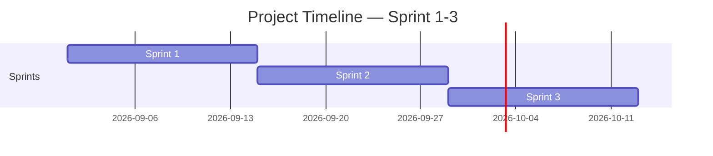

<!-- Template เต็มไฟล์สำหรับสร้าง docs/agile/02-sprint-backlog.md -->

<!-- ภาพรวมว่า Story ไหนไปอยู่ Sprint ไหนตลอด 4 Sprint — ไม่ต้องระบุคนรับผิดชอบ/Status ที่นี่ ส่วนนั้นอยู่ใน sprint-plan-[NN].md ของ Sprint ที่กำลังทำ -->

# Sprint Backlog

**Version:** 1.0 | **Last Updated:** 2026-09-01

> ภาพรวมว่า User Story ไหนจาก `01-product-backlog.md` จะไปอยู่ Sprint ไหน — Sprint ที่ยังไม่ถึงคือ draft คร่าวๆ ปรับได้เสมอเมื่อเข้าใจงานมากขึ้น

## Timeline (3 Sprint, Sprint ละ 2 สัปดาห์)

| Sprint   | เริ่ม | สิ้นสุด |
| -------- | ---------- | -------------- |
| Sprint 1 | 2026-09-01 | 2026-09-14     |
| Sprint 2 | 2026-09-15 | 2026-09-28     |
| Sprint 3 | 2026-09-29 | 2026-10-12     |

> ปรับวันที่ให้ตรงกับวันที่ทีมเริ่มลงมือทำจริง (ถ้าไม่ใช่วันแลปนี้)

## Sprint 1 (กำลังทำ)

| # | User Story                                                                                                                           | MoSCoW    | Estimate (SP) |
| - | ------------------------------------------------------------------------------------------------------------------------------------ | --------- | ------------- |
| 1 | ในฐานะผู้เล่น ฉันต้องการเข็นรถเข็น เพื่อขนย้ายตัวอย่างไปทดลอง             | Must Have | 5             |
| 2 | ในฐานะผู้เล่น ฉันต้องการเดิน และเดินเร็วได้ เพื่อเล่นเกม                        | Must Have | 5             |
| 3 | ในฐานะผู้เล่น ฉันต้องการพูดคุย กับ NPC และ Narrator เพื่อดำเนินเนื้อเรื่อง | Must Have | 8             |

## Sprint 2 (Draft)

| #  | User Story                                                                                                                                                                             | MoSCoW       | Estimate (SP) |
| -- | -------------------------------------------------------------------------------------------------------------------------------------------------------------------------------------- | ------------ | ------------- |
| 1  | ในฐานะผู้เล่น ฉันต้องการทดสอบสารเคมี เพื่อทำภารกิจของเกม                                                                         | Must Have    | 5             |
| 2  | ในฐานะผู้เล่น ฉันต้องการสแกนตัวอย่าง เพื่อทำภารกิจของเกม                                                                         | Must Have    | 5             |
| 3  | ในฐานะผู้เล่น ฉันต้องการส่องตัวอย่างใต้กล้องจุลทรรศน์ เพื่อทำภารกิจของเกม                                      | Must Have    | 5             |
| 4  | ในฐานะผู้เล่น ฉันต้องการชำแหละตัวอย่างชิ้นเนื้อ เพื่อใช้ทำภารกิจของเกม                                            | Must Have    | 5             |
| 5  | ในฐานะผู้เล่น ฉันต้องการเปิดแทปเล็ต เพื่อตรวจสอบข้อมูลต่างๆ                                                                  | Must Have    | 6             |
| 6  | ในฐานะผู้เล่น ฉันต้องการส่งข้อมูลการทดลองทั้งหมด เพื่อทำภารกิจหลัก                                                     | Must Have    | 4             |
| 7  | ในฐานะผู้เล่น ฉันต้องการทำลายตัวอย่างชิ้นเนื้อ เพื่อป้องกันไม่ให้มอนสเตอร์ก่ออันตราย                 | Must Have    | 5             |
| 8  | ในฐานะผู้เล่น ฉันอยากให้การมองเห็นฉากในเกมมีความสมจริง                                                                            | Should Have  | 3             |
| 9  | ในฐานะผู้เล่น ฉันอยาให้มี NPC อยู่ในแผนที่                                                                                                         | Should Have  | 6             |
| 10 | ในฐานะผู้เล่น ฉันอยากมีอุปกรณ์ช่วยเหลือเพิ่มเติม เพื่อรับมือกับเหตุการณ์ไม่คิดที่อาจเกิดขึ้น | Nice to Have | 7             |

## Sprint 3 (Draft)

| # | User Story                                                                                                                                                                             | MoSCoW       | Estimate (SP) |
| - | -------------------------------------------------------------------------------------------------------------------------------------------------------------------------------------- | ------------ | ------------- |
| 1 | ในฐานะมอนสเตอร์ ฉันต้องการปิดไฟ เพื่อก่อกวนผู้เล่น                                                                                   | Must Have    | 5             |
| 2 | ในฐานะมอนสเตอร์ ฉันต้องการเคลื่อนย้ายตำแหน่งเมื่อผู้เล่นไม่จัดการฉันดีพอ เพื่อก่อกวนผู้เล่น | Must Have    | 3             |
| 3 | ในฐานะมอนสเตอร์ ฉันต้องการไล่ต้อนผู้เล่น เพื่อก่อกวนผู้เล่น                                                                 | Must Have    | 3             |
| 4 | ในฐานะมอนสเตอร์ ฉันต้องการปล่อยแก๊สพิษ เพื่อก่อกวนผู้เล่น                                                                     | Must Have    | 3             |
| 5 | ในฐานะผู้เล่น ฉันต้องการเห็นมินิแมป เพื่อช่วยในการสำรวจพื้นที่                                                            | Must Have    | 4             |
| 6 | ในฐานะผู้เล่น ฉันอยากเห็นเนื้อเรื่องเป็นฉากคัทซีน                                                                                      | Should Have  | 7             |
| 7 | ในฐานะผู้เล่น ฉันอยากได้ยินเสียงบทสนทนา                                                                                                          | Should Have  | 6             |
| 8 | ในฐานะผู้เล่น ฉันอยากให้แผนที่มีความสมจริงในแต่ละพื้นที่ เช่น มีไฟกระพริบในบางจุด                        | Nice to Have | 6             |

> **Sprint 2-3 คือ draft ระดับ release plan** — เป้าหมายคือฝึกกะจำนวน SP ต่อ Sprint ให้ใกล้เคียง capacity ของทีม ไม่ใช่ล็อก scope ตายตัว ปรับได้ทุกครั้งที่ทำ Sprint Planning ของ Sprint ถัดไป

> เมื่อ Sprint ไหนเริ่มทำงานจริง ให้คัลอก template `sprint-plan-template.md` (ไฟล์แนบใน LMS) ไปสร้าง `docs/agile/sprint-plan-[NN].md` แล้วดึง Story ของ Sprint นั้นจากตารางด้านบนมาใส่คนรับผิดชอบ แตก Task และปรับ Estimate ให้ละเอียดขึ้น

## Links

- [[docs/agile/01-product-backlog|Product Backlog]]
- [[docs/agile/sprint-plan-01|Sprint 1 Plan]]
